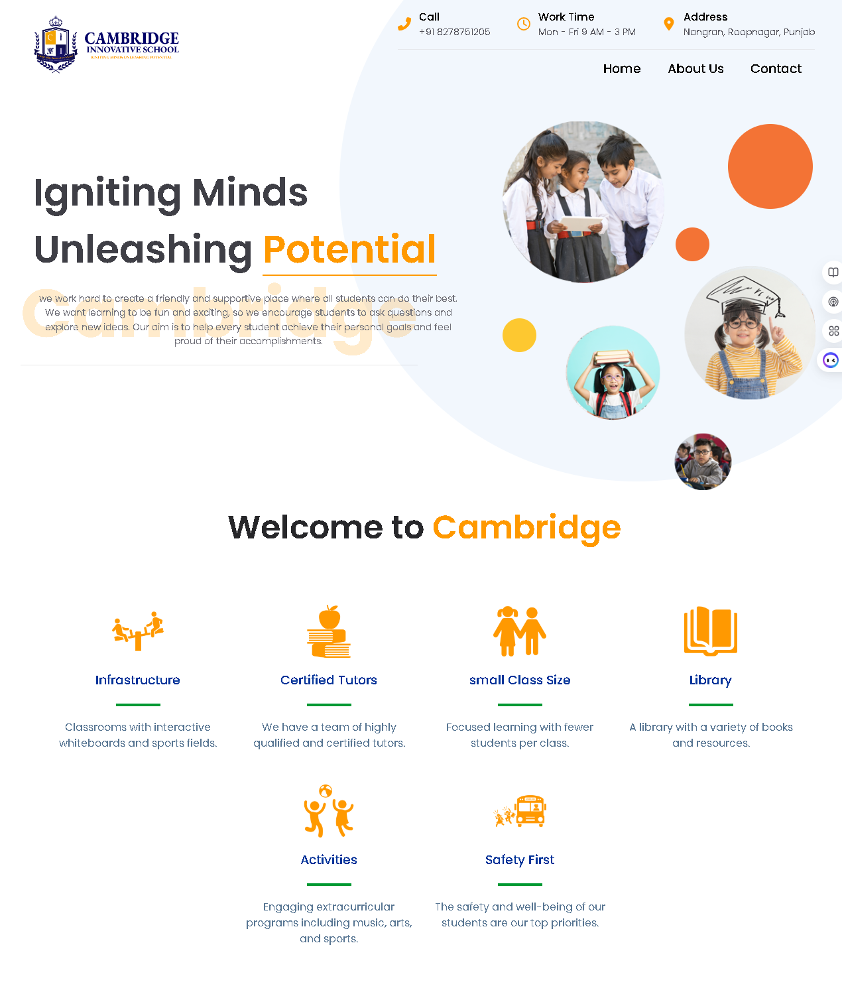

# CAMBRIDGE-INNOVATIVE-SCHOOL

*Empowering Future Innovators Through Inspired Learning*


### Built with the tools and technologies:


---

## 🖼️ Demo

👉 [Live Demo](https://www.cambridgesmartschool.com/)

---


## Table of Contents

- [Screenshots](#screenshots)
- [Overview](#overview)
- [Getting Started](#getting-started)
  - [Prerequisites](#prerequisites)
  - [Installation](#installation)
  - [Usage](#usage)
  - [Testing](#testing)

---

## Screenshots



---

## Overview

**Cambridge-Innovative-School** is a modern React-based frontend template crafted for educational platforms, focusing on speed, scalability, and maintainability. It leverages Vite for rapid builds, Tailwind CSS for streamlined styling, and a modular component architecture to facilitate scalable development.

### Why cambridge-innovative-school?

This project aims to deliver a fast, responsive, and easy-to-maintain frontend foundation for school websites. The core features include:

- ⚡ **Fast Development**: Utilizes Vite with React for quick builds and hot module replacement, enhancing developer productivity.
- 🎨 **Tailwind CSS Integration**: Simplifies styling with a configured PostCSS setup, enabling consistent and responsive design.
- 🧱 **Modular Components**: Offers a structured, component-driven architecture for scalable UI development.
- 📱 **Responsive & Interactive UI**: Features animated navigation and adaptable layouts for seamless user experiences.
- 🗂️ **Clear Project Structure**: Organized setup with dedicated pages and components for easy maintenance and extension.
- 🛠️ **Optimized Tooling**: Incorporates ESLint, Babel/SWC, and other tools to ensure code quality and performance.

---

## Getting Started

### Prerequisites

This project requires the following dependencies:

- **Programming Language**: JavaScript
- **Package Manager**: npm

---

### Installation

Build `cambridge-innovative-school` from the source and install dependencies:

1. **Clone the repository**:

    ```bash
    git clone https://github.com/prashant19982004/cambridge-innovative-school
    ```

2. **Navigate to the project directory**:

    ```bash
    cd cambridge-innovative-school
    ```

3. **Install the dependencies**:

    Using **npm**:

    ```bash
    npm install
    ```

---

### Usage

Run the project with:

Using **npm**:

```bash
npm start
